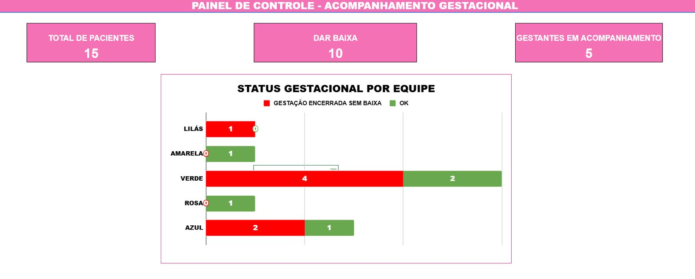
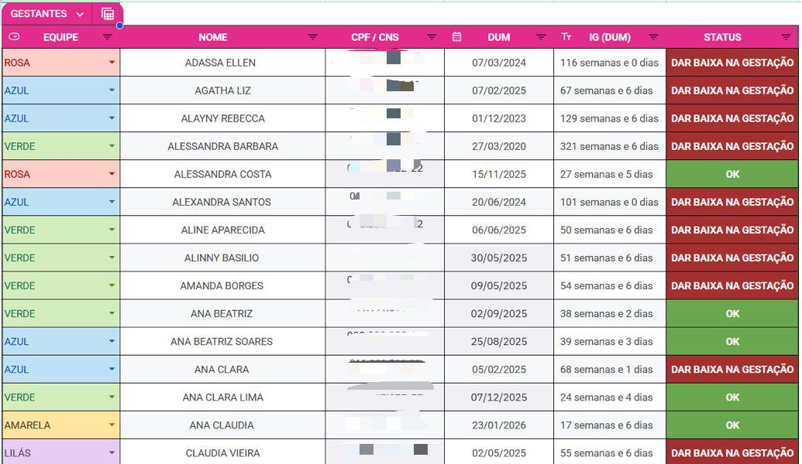
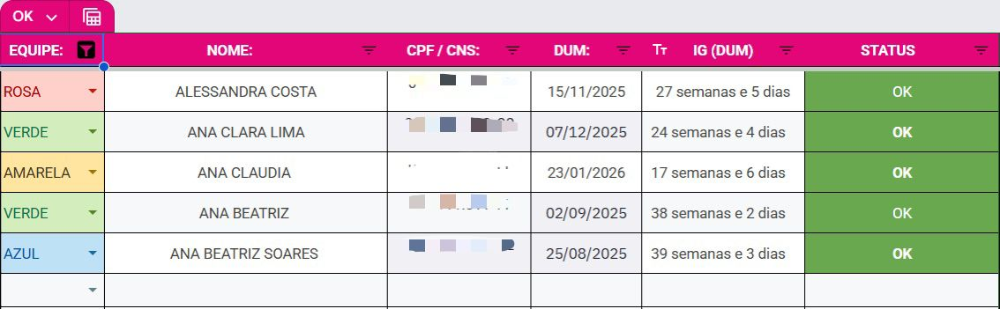
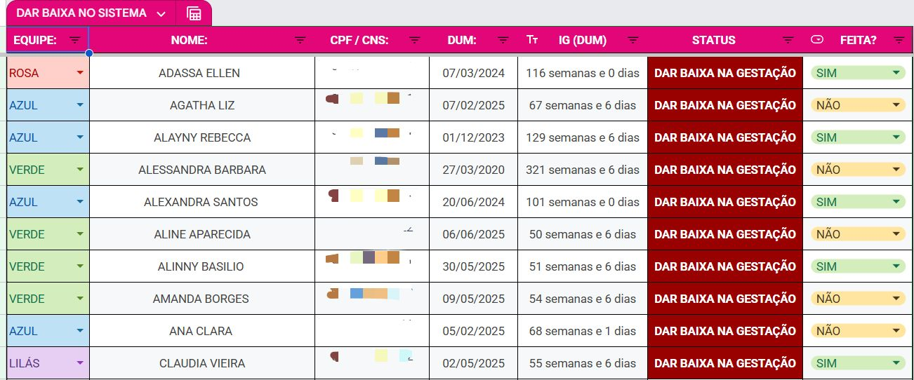

# Projeto de Otimização do Acompanhamento Gestacional

Projeto desenvolvido em Google Planilhas com foco em automação operacional, organização gestacional e visualização de indicadores.

---
## Sobre o projeto

Este projeto foi desenvolvido com o objetivo de otimizar o acompanhamento gestacional através de uma estrutura automatizada em Google Planilhas, facilitando a visualização, organização e acompanhamento operacional das gestantes.

A proposta surgiu a partir da dificuldade de identificar, dentro de um grande volume de pacientes, quais gestantes ainda estavam em acompanhamento e quais já necessitavam de baixa gestacional, tornando o processo muito manual e dependente de consultas constantes no sistema.

A solução desenvolvida permitiu centralizar informações, automatizar classificações e gerar indicadores visuais capazes de facilitar a rotina operacional e reduzir retrabalho manual.

---

# Objetivos do projeto

* Facilitar a visualização das gestantes em acompanhamento
* Identificar automaticamente pacientes com necessidade de baixa gestacional
* Reduzir retrabalho manual
* Melhorar a organização operacional
* Automatizar cálculos gestacionais
* Criar indicadores visuais por equipe
* Facilitar ações de acompanhamento e acolhimento

---

# Estrutura da planilha

O projeto foi dividido em diferentes abas automatizadas para facilitar a organização das informações:

##  Controle Gestacional

Estrutura principal responsável pelo armazenamento das informações das pacientes, cálculo automático da idade gestacional e atualização dinâmica de status.

## Gestantes em Acompanhamento

Aba automatizada responsável por separar dinamicamente as pacientes que permanecem em acompanhamento gestacional.

## Pacientes com Necessidade de Baixa

Aba automatizada para identificação rápida das pacientes que necessitam de encerramento gestacional no sistema.

## Dashboard Operacional

Painel visual desenvolvido para facilitar a análise rápida dos indicadores gestacionais por equipe.

---

# Funcionalidades desenvolvidas

* Cálculo automático da idade gestacional
* Atualização automática de status
* Separação automática de pacientes
* Indicadores operacionais por equipe
* Dashboards automatizados
* Filtros automáticos
* Menus suspensos para categorização
* Formatação condicional para alertas visuais
* Organização dinâmica das informações

---

# Tecnologias e recursos utilizados

## Fórmulas
- SE
- FILTER
- CONT.SE
- CONT.SES
- HOJE

## Recursos do Google Planilhas
- Formatação condicional
- Menus suspensos
- Dashboards automatizados
- Indicadores visuais
- Filtros dinâmicos
- Organização automatizada de dados
  
Durante o desenvolvimento do projeto foram utilizadas funções e recursos do Google Planilhas como:

## Fórmulas

* SE
* FILTER
* CONT.SE
* CONT.SES
* HOJE

## Recursos

* Formatação condicional
* Menus suspensos
* Dashboards
* Indicadores visuais
* Organização automatizada de dados

---

# Dashboard operacional

O dashboard foi desenvolvido com foco em facilitar a visualização rápida dos indicadores mais importantes do acompanhamento gestacional.

Entre os principais indicadores apresentados estão:

* Total de pacientes
* Gestantes em acompanhamento
* Pacientes com necessidade de baixa
* Distribuição por equipes
* Indicadores operacionais automatizados

A utilização de dashboards reduziu significativamente o tempo necessário para localizar informações e facilitou o acompanhamento visual dos dados.

---

# Impacto operacional

A estrutura desenvolvida contribuiu para:

* Redução de retrabalho manual
* Melhor visualização das informações
* Organização mais eficiente das pacientes
* Facilidade na identificação de pendências
* Otimização do acompanhamento operacional
* Centralização das informações

---

# Impacto social

Além da organização operacional, a estrutura também auxiliou ações coletivas voltadas ao acolhimento e acompanhamento gestacional.

A melhoria na visualização das pacientes em acompanhamento facilitou o desenvolvimento de ações multidisciplinares e atividades coletivas voltadas ao cuidado gestacional.

---

# Competências desenvolvidas

Este projeto contribuiu diretamente para o desenvolvimento de habilidades como:

* Análise de dados
* Organização operacional
* Automação de processos
* Visualização de dados
* Criação de dashboards
* Resolução de problemas
* Estruturação de fluxos operacionais

---

# Melhorias futuras

* Integração com formulários automatizados
* Expansão dos indicadores operacionais
* Criação de relatórios automatizados
* Padronização para múltiplas equipes
* Estruturação de documentação operacional

---

# Observação

Os dados apresentados nas imagens e demonstrações foram anonimizados para preservar a privacidade e confidencialidade das informações

---

# Demonstração visual

## Dashboard Operacional

## Controle Gestacional

## Pacientes com Necessidade de Baixa

## Gestantes em Acompanhamento

